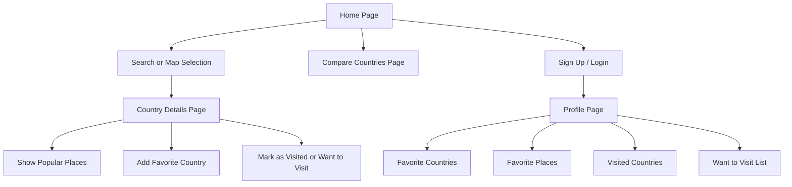
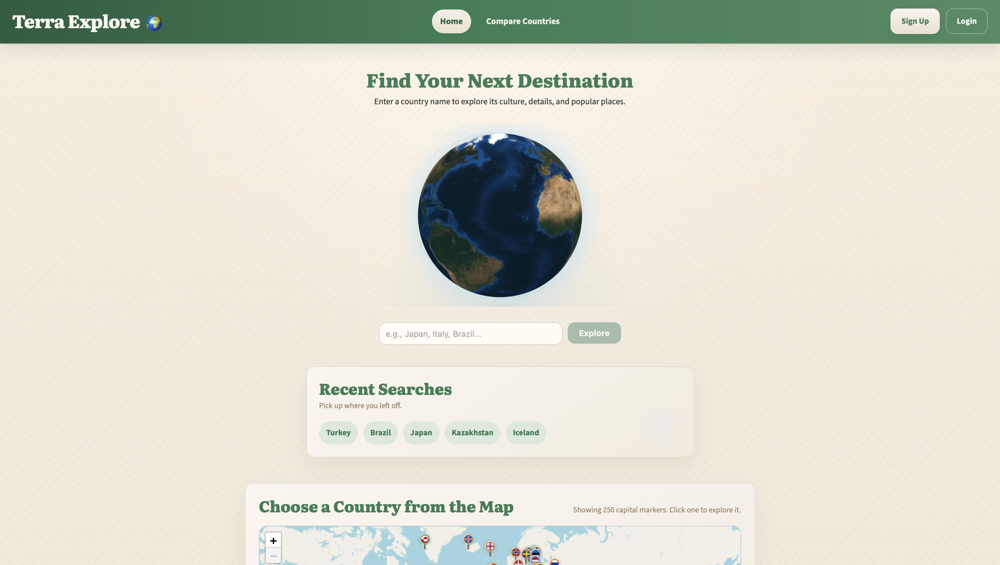
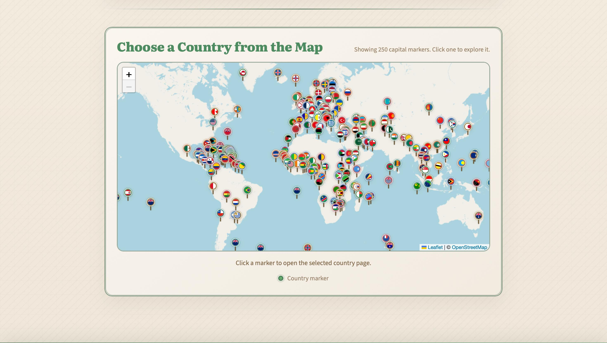
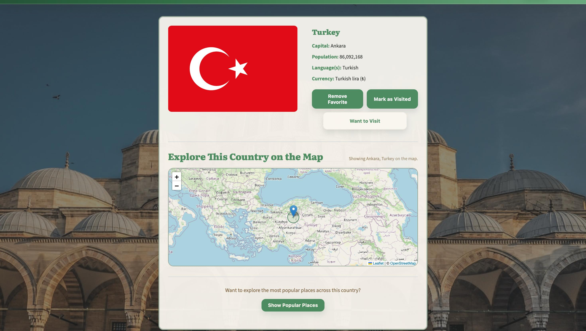
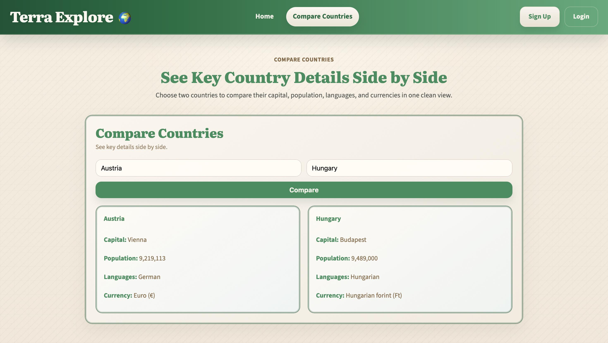
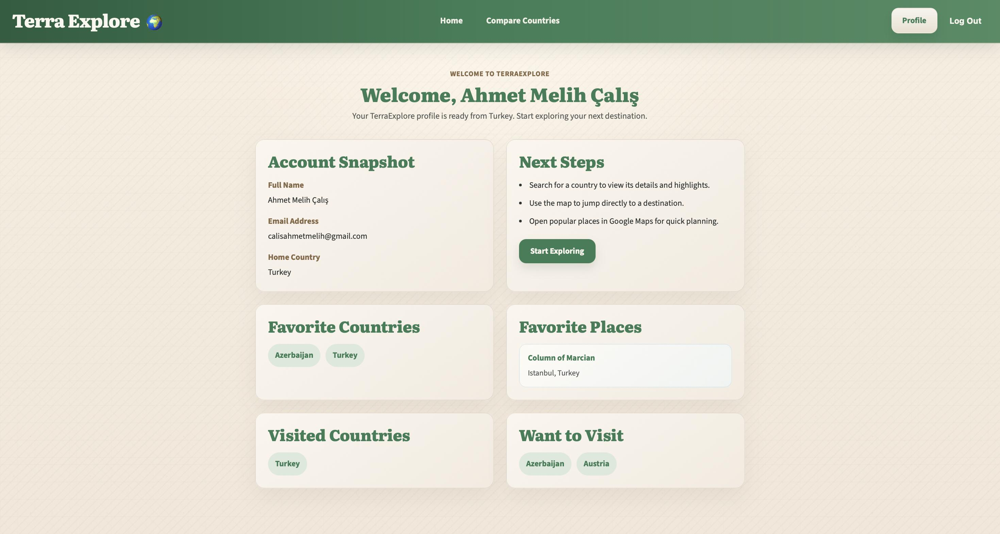

# Terra Explore

Terra Explore is a static travel discovery web project built for the Web Technologies course at Kocaeli University. Users can search for countries, explore country details, see popular places, compare two countries, and keep a simple local profile with favorites and travel status.

## Developers

- Murat Uymaz
- Ahmet Melih Çalış

## Features

- Search countries by name with autocomplete
- Select countries from an interactive Leaflet world map
- View country details such as capital, population, languages, and currencies
- Load popular places for each country and open them in Google Maps
- Compare two countries side by side
- Use demo `Sign Up`, `Login`, and `Profile` pages
- Save recent searches, favorite countries, favorite places, and `Visited / Want to Visit` status with `localStorage`
- See a rotating 3D globe on the home page

## Technologies

- HTML
- CSS
- JavaScript
- [Leaflet](https://leafletjs.com/) for maps
- [Globe.gl](https://globe.gl/) for the rotating 3D globe

## APIs Used

- [REST Countries](https://restcountries.com/)
- [GeoNames](https://www.geonames.org/)
- [OpenTripMap](https://opentripmap.io/)
- [Pixabay](https://pixabay.com/api/docs/)

## Pages

- `index.html` – home page with search, globe, recent searches, and world map
- `country.html` – country detail page with map and popular places
- `compare-countries.html` – country comparison page
- `signup.html` – demo sign up page
- `login.html` – demo login page
- `profile.html` – user profile page

## Flow Diagram



## Project Structure

```text
Terra-Explore/
├── docs/                    # Project screenshots used in the README
├── css/                     # Shared and page-specific style files
├── js/                      # API, page logic, auth, and local storage scripts
├── index.html               # Home page with search, globe, and world map
├── country.html             # Country details and popular places page
├── compare-countries.html   # Country comparison page
├── signup.html              # Demo sign up page
├── login.html               # Demo login page
├── profile.html             # User profile page
└── README.md                # Project documentation
```

## Screenshots

### Home Page




### Country Details


### Compare Countries


### Profile Page


## Setup

This project does not require a build step or Node.js.

1. Create your local config file:

   - Copy `js/config.example.js`
   - Rename the copy to `js/config.js`

2. Add your own API credentials to `js/config.js`:

   - `restCountries`
   - `pixabay`
   - `geoNamesUsername`
   - `openTripMap`

3. Open `index.html` in a browser.

If your browser blocks some API behavior when opening the file directly, run the project with a simple local server instead.

## Config Notes

`js/config.js` includes:

- API base URLs
- API keys / usernames
- 24-hour cache settings
- GeoNames settings
- Popular places settings

For REST Countries v5, add your local origin to the API key's allowed origins in the REST Countries dashboard. For local development with Live Server, include `http://127.0.0.1:5500` or `http://localhost:5500`, depending on the URL you open in the browser.

`js/config.js` is meant to stay local. The repository should only include `js/config.example.js`.

## Notes

- The signup and login flow is a frontend demo flow.
- User data and travel lists are stored locally in the browser with `localStorage`.
